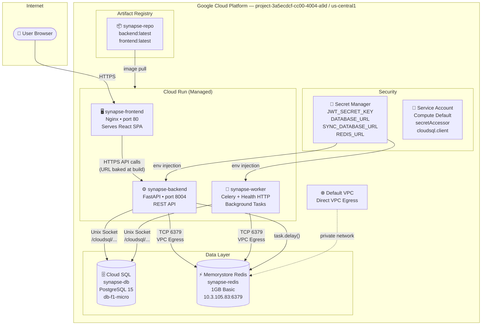

# Synapse — GCP Architecture

## Architecture Diagram

---

## Resource Breakdown

### 1. Cloud Run — `synapse-frontend`
| Property | Value |
|----------|-------|
| Image | `synapse-repo/frontend:latest` |
| Port | 80 (Nginx) |
| Access | Public (`--allow-unauthenticated`) |
| Memory | 256 MB |

**What it does:** Serves the React (Vite) single-page application via Nginx. The backend API URL (`https://synapse-backend-...run.app`) is **baked into the JavaScript bundle** at Docker build time via the `VITE_API_URL` build argument. No server-side processing — pure static file serving.

---

### 2. Cloud Run — `synapse-backend`
| Property | Value |
|----------|-------|
| Image | `synapse-repo/backend:latest` |
| Port | 8004 (Uvicorn/FastAPI) |
| Access | Public (`--allow-unauthenticated`) |
| Memory | 512 MB |
| Min instances | 1 (always warm) |
| VPC | Direct VPC Egress → default subnet |
| Cloud SQL | Auth Proxy sidecar (Unix socket) |

**What it does:** The core REST API. Handles all requests from the frontend — auth (JWT), CRUD for notes/tags, and triggering Celery analysis tasks by pushing a message to Redis. On startup, it runs `init_db()` to create database tables if they don't exist.

---

### 3. Cloud Run — `synapse-worker`
| Property | Value |
|----------|-------|
| Image | `synapse-repo/backend:latest` (same image, different entrypoint) |
| Entrypoint | `python run_worker.py` |
| Port | 8080 (health-check HTTP server) |
| Access | Private (`--no-allow-unauthenticated`) |
| Memory | 512 MB |
| Min instances | 1 (always listening) |
| VPC | Direct VPC Egress → default subnet |
| Cloud SQL | Auth Proxy sidecar (Unix socket) |

**What it does:** Runs the Celery worker process. Polls Redis for queued tasks, processes `analyze_note_task` jobs (simulated AI analysis), and writes the sentiment result back to Cloud SQL. Uses `run_worker.py` as a wrapper that runs a lightweight HTTP health-check server on port 8080 (satisfying Cloud Run's requirement) alongside the Celery worker.

---

### 4. Cloud SQL — `synapse-db`
| Property | Value |
|----------|-------|
| Engine | PostgreSQL 15 |
| Tier | `db-f1-micro` (1 vCPU, 614 MB RAM) |
| Region | `us-central1` |
| Connection | Via Cloud SQL Auth Proxy (Unix socket at `/cloudsql/<connection-name>`) |
| Tables | `user`, `note`, `tag`, `notetaglink` |

**What it does:** Primary relational database. Stores all application data — users, notes, tags, and the many-to-many note↔tag links. Both the backend and worker connect via **Unix domain socket** (no TCP, no exposed port) through the Cloud SQL Auth Proxy sidecar automatically injected by Cloud Run.

---

### 5. Memorystore (Redis) — `synapse-redis`
| Property | Value |
|----------|-------|
| Version | Redis 7 |
| Tier | Basic (no replication) |
| Memory | 1 GB |
| Private IP | `10.3.105.83:6379` |
| Access | VPC-internal only |

**What it does:** Two roles:
- **Celery broker** — backend pushes task messages here (`analyze_note_task.delay()`), worker pops and executes them
- **Celery result backend** — stores task completion status/results so the backend can poll `GET /tasks/{id}/status`
- **JWT blacklist** — revoked tokens on logout are stored here with a TTL

---

### 6. Artifact Registry — `synapse-repo`
| Property | Value |
|----------|-------|
| Format | Docker |
| Region | `us-central1` |
| Images | `backend:latest`, `frontend:latest` |

**What it does:** Private Docker image registry. Cloud Run pulls images from here on every deployment. Images are built locally with Docker and pushed via `docker push`.

---

### 7. Secret Manager
| Secret | Value Stored | Used By |
|--------|-------------|---------|
| `JWT_SECRET_KEY` | Signing key for JWT tokens | `synapse-backend` |
| `DATABASE_URL` | asyncpg connection string (Cloud SQL socket) | `synapse-backend` |
| `SYNC_DATABASE_URL` | psycopg2 connection string (Cloud SQL socket) | `synapse-worker` |
| `REDIS_URL` | `redis://10.3.105.83:6379/0` | `synapse-backend`, `synapse-worker` |

**What it does:** Stores sensitive credentials encrypted at rest. Cloud Run services reference secrets with `--set-secrets` — GCP injects them as environment variables at container startup. No passwords are ever stored in code or Docker images.

---

### 8. Service Account (Compute Default)
| Role | Purpose |
|------|---------|
| `roles/secretmanager.secretAccessor` | Read secrets from Secret Manager |
| `roles/cloudsql.client` | Connect to Cloud SQL via Auth Proxy |

**What it does:** The identity Cloud Run services run as. IAM roles grant the minimum permissions needed — follows the principle of least privilege.

---

## Key Design Decisions

| Decision | Why |
|----------|-----|
| **Direct VPC Egress** instead of VPC Connector | Cheaper (no extra resource), simpler, enough for private Redis access |
| **Cloud SQL Auth Proxy via Unix socket** | No public IP needed, encrypted, uses IAM auth — production standard |
| **Same image for backend + worker** | Single build pipeline, worker invoked with a different entrypoint |
| **`run_worker.py` health wrapper** | Cloud Run requires an HTTP listener; Celery doesn't have one |
| **`VITE_API_URL` baked at build time** | Vite is a static bundler — env vars must be embedded at build, not runtime |
| **Min instances = 1** | Avoids cold starts for both API and worker (tasks process immediately) |
